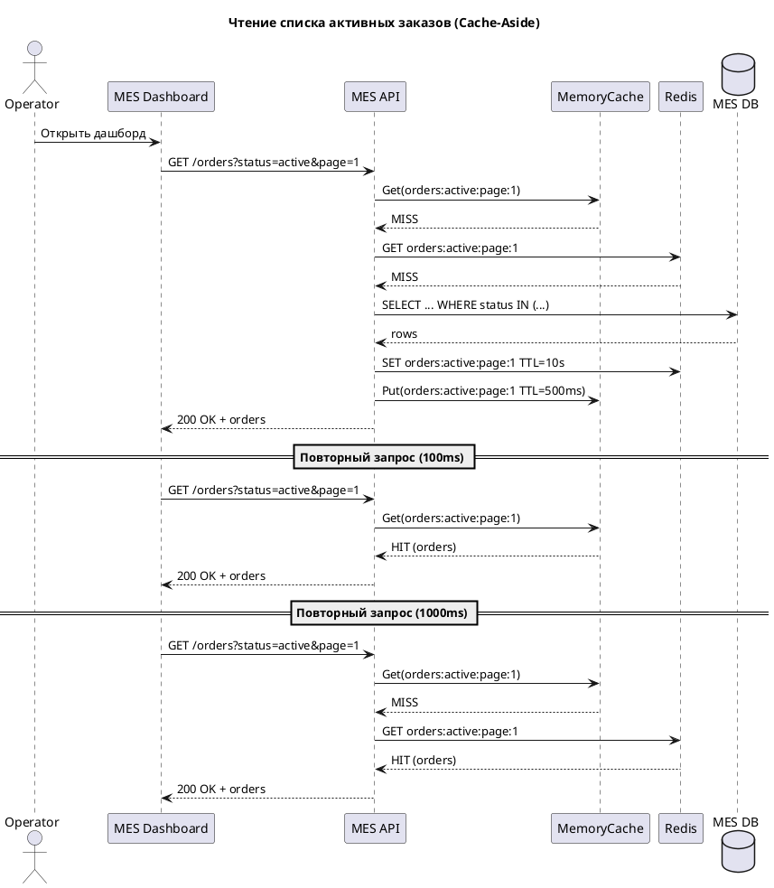
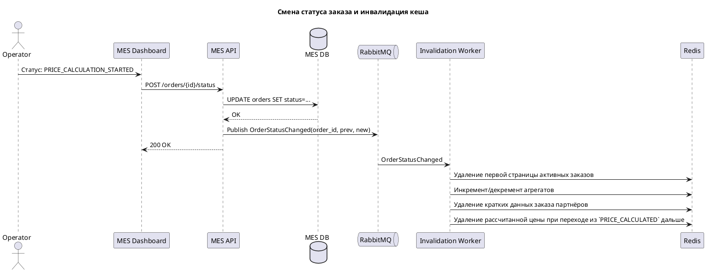

# 1. Что стоит кешировать

\* Приоритет в порядке перечисления

1. Список «новых» / «активных» заказов для первой страницы MES (помимо оптимизации sql-запроса).
    * _Мотивация_: снижение высокой задержки загрузки дашборда MES (тяжёлые повторяющиеся запросы к единственной базе данных), высокая повторяемость фильтров (аналогично агрегатам).
2. Результат расчёта цены изготовления модели (`PRICE_CALCULATED`).
    * _Мотивация_: Длительная недоступность результата вычисления стоимости (2–30 минут) может приводить к повторным запросами клиентов и партнёров до получения результата, создавая избыточную нагрузку.
3. Агрегаты для дашборда (количества по статусам).
    * _Мотивация_: Каждый оператор видит одинаковые значения агрегатов, пересчитываются заново для каждого оператора, создавая избыточную нагрузку на базу данных.
    * Обновление может быть реализовано инкрементом/декрементом при смене статуса заказа.
4. Справочники / референсные данные:
    1. список возможных статусов (state machine metadata),
    2. тарифные коэффициенты, материалы, типы покрытий.
    * _Мотивация_: низкая изменчивость данных, частое использование.
5. Партнёрские повторные GET заказов
    * _Мотивация_: Избавляет от риска деградации при многократных опросах состояния.

# 2. Мотивация

\* Мотивация по отдельным инициативам кеширования описана выше, в их перечислении.

## 2.1 Какие проблемы решает кеширование
- Снижает p95/p99 latency первой страницы MES за счёт выдачи списков «активных заказов» из памяти.
- Повышает продуктивность оператора (снижается время ожидания загрузки страницы, он может быстрее взять заказ в работу).
- Уменьшает нагрузку на единственный экземпляр MES/CRM БД.
- Повышает доступность справочников, референсов, кардинально снижает стоимость их повторного использования.
- Снижает повторную стоимость дорогостоящего вычисления стоимости изготовления изделия.
- Помогает стабилизировать SLA партнёрского API (быстрый ответ).

**Элементы для включения в кеш**
1. Список активных/новых заказов (пагинированные сегменты).
2. Результат расчёта цены, сопутствующий статусу `PRICE_CALCULATED` (до перехода в `MANUFACTURING_APPROVED`).
3. Агрегированные счётчики заказов по статусам.
4. Справочники статусов, материалов, тарифных коэффициентов.
5. Состояние заказа для партнёрских повторных запросов.

# 3. Предлагаемое решение
Для решения существующих проблем бизнеса предлагается использовать серверное кеширование (Redis).
- Основная проблема – медленные серверные выборки (дашборд MES, агрегаты). Клиентский кеш не решит конкуренцию разных операторов за ресурсы базы данных и не ускорит для них первичную загрузку.
- Необходимость централизованной инвалидации при смене статуса.

## 3.1 Используемые компоненты
- Redis.
- Локальный in‑memory кеш как краткоживущий слой (500–1000 ms TTL) поверх Redis для удаления сетевого взаимодействия при множественных обновлениях дашборда разными операторами.
- Событийный канал (RabbitMQ) сигнализирует компоненту Invalidation Worker о смене статуса, а он в ответ обновляет / удаляет соответствующие ключи.

## 3.2 Кешируемые сущности
1. Список активных заказов — Cache-Aside, событийная инвалидация.
2. Результат расчёта цены — Cache-Aside.
3. Агрегаты — Cache-Aside (инкремент/декремент по событию статуса).
4. Статус заказа для партнёрских API — Cache-Aside.
5. Справочники — Cache-Aside.

Использованный паттерн – Cache-Aside. Выбор сделан в его пользу из-за простоты, минимального изменения кода при внедрении, отсутствия необходимости прогрева кеша.

Write-Through не подходит из-за низкой доли записи относительно чтений (последовательной работы с базой данных при каждой записи), добавления latency к транзакциям статуса.
Refresh-Ahead не подходит из-за большого разброса ключей – агрессивный прогрев данных заказов даст высокую долю бесполезных обновлений.
Write-Behind не подходит из-за высоких требований к консистентности первичного источника (базы данных). Отложенные записи в кеш не дают выгоды: мы читаем чаще, чем пишем.

# 4. Диаграмма последовательности

---

- Cache-Aside: читается MemoryCache, при промахе – Redis, при промахе — БД, после чего заполняется кеш.
- Инвалидация: событие смены статуса запускает точечное удаление данных, а также перерасчёт агрегатов.
- Производные структуры (страницы, агрегаты) пересобираются только при реальном чтении после инвалидации, снижая нагрузку на запись.

# 5. Стратегия инвалидации кеша
Для инвалидации используются шаблоны инвалидации на основе изменений и по ключу. Событие смены статуса заказа в Redis (OrderStatusChanged) приводит к удалению/модификации данных:
   - удаление первой страницы активных заказов,
   - инкремент/декремент агрегатов,
   - удаление кратких данных заказа партнёров,
   - удаление рассчитанной цены при переходе из `PRICE_CALCULATED` дальше про графу статусов.

Этот подход минимизирует стоимость записи, помогает избежать пересчёта производных страниц, контролировать устаревание.

Временная инвалидация создаст окна неконсистентности до истечения TTL и последующего обновления при промахе.
Инвалидация, основанная на запросах, не так гибка, часто не коррелирует с изменением данных. Например, частые запросы к первой странице активных заказов не указывают на то, что они не изменяются – наоборот, содержимое страницы заказов должно изменяться вслед за изменением заказов, а применение сортировки `updated_at` должно изменять положение заказов друг относительно друга.
Максимальная гибкость программной инвалидации не потребовалась (если не считать текущую реализацию инвалидации на основе изменений её вариантом).

# 6. Дополнительное задание.
Я не вижу других эффективных способов инвалидации кеша. Все они, кажется, будут менее эффективными, или потребуют больший объём вмешательства для реализации без предоставления заметного роста производительности.